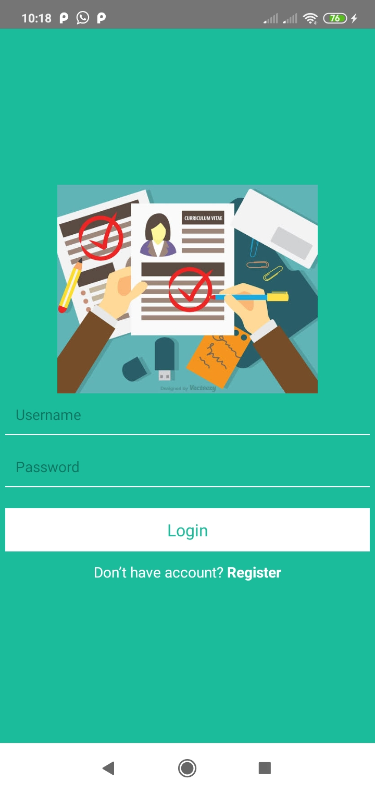
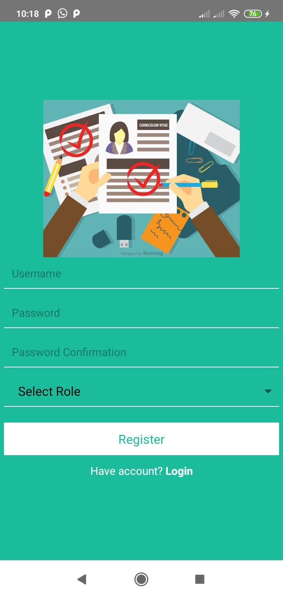
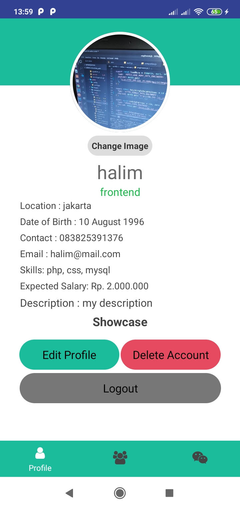
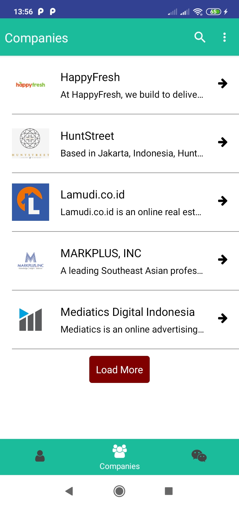
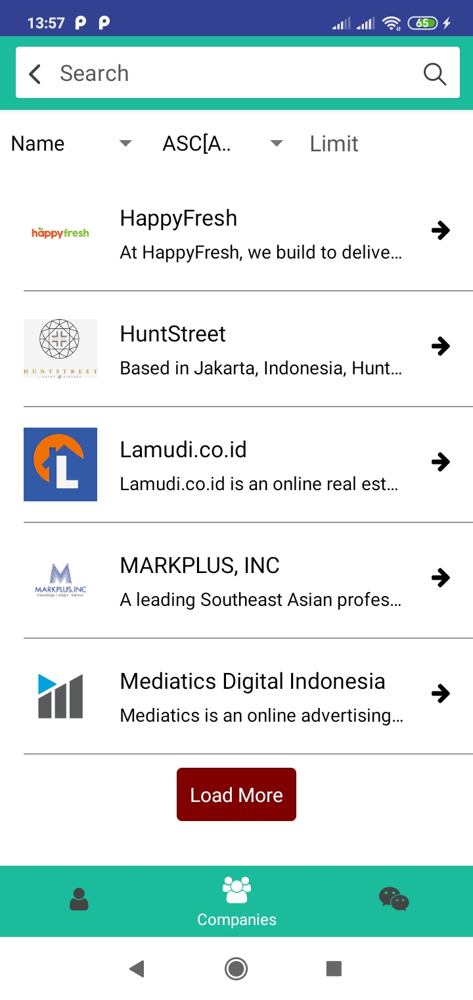
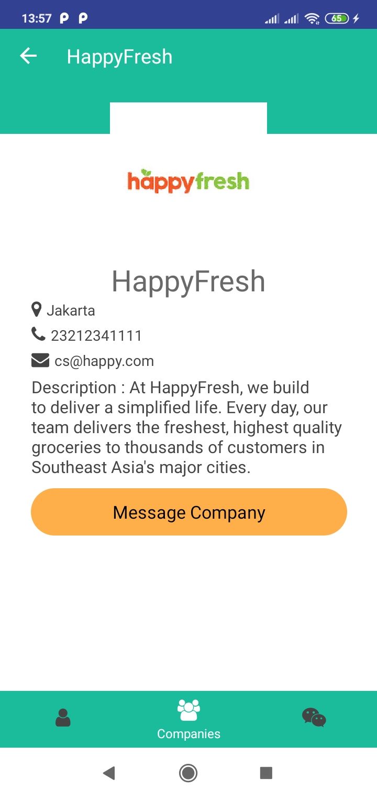

<h1 align="center">React Native - Simple Hiring Channel App Android</h1>

Hiring Channel App is a feature that allows Engineers and Company  to do communicate for looking/hiring jobs. This project for handle frontend only. Built using React Native Framework.
React Native is a JavaScript framework for writing real, natively rendering mobile applications for iOS and Android. [More about React Native](https://facebook.github.io/react-native/)
## Built With
[](https://facebook.github.io/react-native/)

## Requirements
- [`npm`](https://www.npmjs.com/get-npm)
- [`react-native`](https://facebook.github.io/react-native/docs/getting-started)
- [`react-native-cli`](https://facebook.github.io/react-native/docs/getting-started)
- [`backend API`](https://github.com/halim13/hiring-app) (database)
- Smartphone Android

## How to run the app ?
To run Hiring Channel App, follow these steps:
```
- open your terminal
- git clone https://github.com/halim13/hiring-channel-android.git
- cd hiring-channel-android
- npm install
- open .env file and fill the requirement
- npm run android
- npm start
- Make sure your developer mode in your device is connected
```

## Contributing to Hiring Channel App
To contribute to Hiring Channel App, follow these steps:

1. Fork this repository.
2. Create a branch: `git checkout -b <branch_name>`.
3. Make your changes and commit them: `git commit -m '<commit_message>'`
4. Push to the original branch: `git push origin <project_name>/<location>`
5. Create the pull request.

Alternatively see the GitHub documentation on [creating a pull request](https://help.github.com/en/github/collaborating-with-issues-and-pull-requests/creating-a-pull-request).

## Screenshots
<div align="center">
    
    
    
    
    
    
    
</div>

## Release APK

<a href="https://drive.google.com/file/d/1fbkBiJbrgRpUTmFlOs-WQlc4pwHCtee_/view?usp=sharing">
  
</a>

## Related Projects
- [`backend`](https://github.com/halim13/hiring-app)
- [`website`](https://github.com/halim13/hiring-react-js)

## Contact

If you want to contact me you can reach me at <hasanudinhalim@gmail.com>.

Copyright © 2019 by Halim Hasanudin
